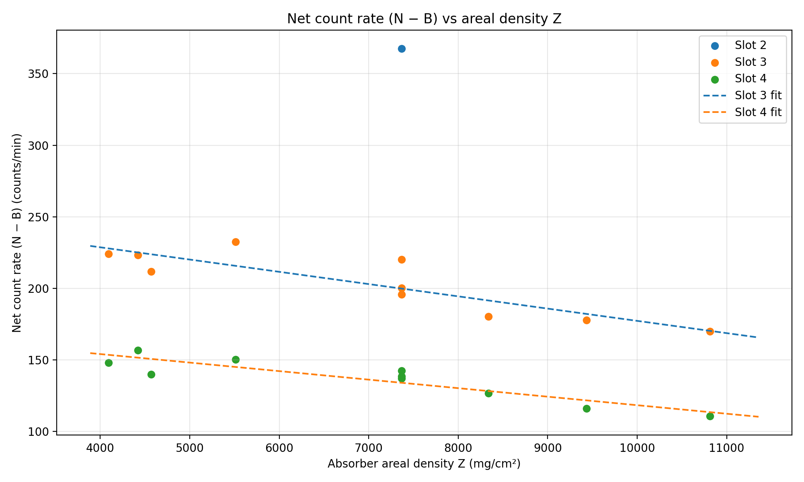
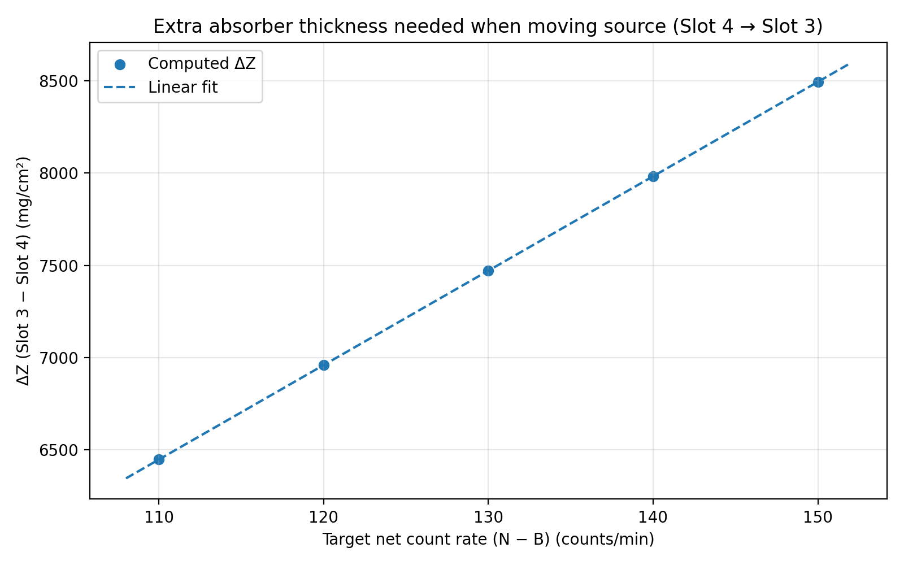
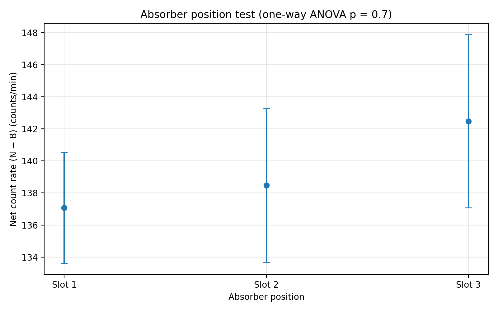

# Co-60 Source Position vs Absorber Thickness (UCSB Physics)

**Author:** Hongyu Wang  
**Instructor:** W. Lippincott  
**Date:** June 5, 2024

## Question
When using a Geiger–Müller (GM) detector with a Co-60 source, **how much additional shielding (absorber areal density) is required to maintain a fixed net count rate when the source is moved to a different slot (i.e., the geometry changes)?**

## Method (high-level)
1. Measure background-subtracted count rate **(N − B)** for several absorber stacks (areal density **Z**, mg/cm²) at different **source slots**.
2. Restrict analysis to the **gamma-dominated** region (thick absorbers) where beta contributions are negligible.
3. Perform linear regression of **(N − B) vs Z** for Slot 3 and Slot 4.
4. Invert both fits to compute the **equivalent thickness difference** ΔZ needed to match a target net rate.
5. Run a control study to verify absorber *position* does not significantly change the net rate at fixed Z.

## Key results
### Net count rate vs absorber areal density


Regression lines (gamma-dominated regime):
- Slot 3: *(N − B) = −0.00857·Z + 263.00*
- Slot 4: *(N − B) = −0.00595·Z + 177.95*

### Equivalent thickness change when moving the source


Over typical operating points, the mapping is approximately linear:
- **ΔZ ≈ 51.38·(N − B) + 781 (mg/cm²)**

Example: for *(N − B) = 130 cpm*, moving Slot 4 → Slot 3 requires **ΔZ ≈ 7.46×10³ mg/cm²**.

### Control: absorber position


A one-way ANOVA across absorber positions gives **p ≈ 0.70**, i.e., no statistically significant difference at fixed Z.

## Reproduce
```bash
# from the repository root
python -m venv .venv
source .venv/bin/activate
pip install -r requirements.txt

python src/analyze_co60.py
```
Outputs are written to `figures/`.

## Repository structure
```text
.
├── data/
│   ├── processed_points.csv
│   └── raw_absorber_position_test.csv
├── src/
│   └── analyze_co60.py
├── figures/                # auto-generated by the script
├── report/                 # LaTeX source + compiled PDF
├── summary/                # one-page, non-technical summary
└── assets/                 # apparatus photo, decay scheme
```

## Writing sample
- Full technical report: `report/report.pdf`
- One-page non-technical summary: `summary/one_page_summary.pdf`
