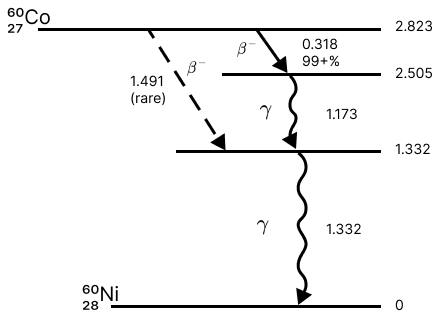

# Co-60 attenuation analysis: source position and absorber thickness

This repository analyzes a Co-60 counting experiment with a Geiger-Muller detector. The central question is how much additional absorber thickness is required to keep the net count rate fixed when the source position changes.

## Project Overview

This project emphasizes transparent modeling choices: background subtraction, restricted
fit ranges, regression inversion, a control test, and generated figures. It is organized
as a compact empirical replication package so another reader can rerun the analysis and
inspect where each reported number came from.

## At a Glance

- **Data workflow:** count-rate measurements, absorber metadata, and control-test data
  are turned into regression figures and a compact quantitative summary.
- **Methods signal:** background subtraction, fit-range restrictions, regression
  inversion, and an explicit negative-control check.
- **Reproducibility signal:** a short Python script rebuilds the figures and regression
  summary from the committed data tables.

The repository is intentionally small: the main figures, regression summary, and control
test can be regenerated from the committed tables with one script.

## Analysis question

For a target background-subtracted net count rate, how does the required absorber areal density change when the source moves from one slot to another?

## Method

1. Use background-subtracted count rates for several absorber stacks and source positions.
2. Restrict the fit to the gamma-dominated region where beta contributions are negligible.
3. Fit net count rate versus areal density for the relevant source slots.
4. Invert the fitted lines to compute the equivalent thickness difference `Delta Z` at fixed net count rate.
5. Run a control test to check whether absorber position alone changes the net rate at fixed areal density.

## Key figures

**Co-60 decay scheme**



**Net count rate versus absorber thickness**


**Equivalent thickness change when moving the source**


**Control test: absorber position**


## Main quantitative results

- Slot 3 fit: `(N - B) = (-0.00857 +/- 0.00167) * Z + (263.00 +/- 12.09)`
- Slot 4 fit: `(N - B) = (-0.00595 +/- 0.00097) * Z + (177.95 +/- 7.05)`
- Central mapping over the operating region:
  `Delta Z ~= 51.22 * (N - B) + 812.66` `mg/cm^2`
- Monte Carlo propagation of the two regression covariance matrices gives coefficient
  uncertainties of about `+/- 41.62` on the slope and `+/- 7081.45 mg/cm^2` on the
  intercept, so the derived mapping should be read as an uncertainty-aware operating
  estimate rather than a high-precision calibration.
- At `N - B = 130 cpm`, moving from Slot 4 to Slot 3 requires about `7.47e3 +/- 2.13e3 mg/cm^2` of additional absorber.

## Control test

The absorber-position test is a negative control: with total absorber thickness held
fixed, the absorber slot itself should not change the net count rate. A one-way ANOVA
on the repeated measurements gives `F = 0.368`, `p = 0.70`, so no detectable
absorber-position effect was found at the fixed areal density used in the control run.

## Reproduce

```bash
python -m venv .venv
pip install -r requirements.txt
python src/analyze_co60.py
```

If `make` is available:

```bash
make all
```

Outputs are written to `figures/`.

Smoke test:

```bash
python -m unittest discover -s tests
```

## Repository structure

```text
data/     Processed attenuation points and raw control-test data
src/      Python analysis script
figures/  Generated plots and regression summary
report/   Technical report
summary/  One-page non-technical summary
assets/   Apparatus photo and decay scheme
```

## Writing sample

- Technical report: `report/report.pdf`
- One-page summary: `summary/one_page_summary.pdf`

## Attribution

Author: Hongyu Wang.  
Instructor: W. Lippincott, Department of Physics, UC Santa Barbara.
